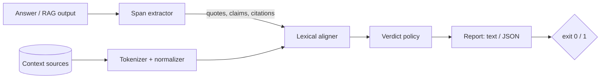

# groundcheck

[English](README.md) | [中文](README.zh.md) | [日本語](README.ja.md)

[](LICENSE) [](CHANGELOG.md) [](pyproject.toml)  [](CONTRIBUTING.md)

**RAG / LLM 出力のためのオープンソース・グラウンディング検証器：出力中のすべての引用とすべての主張が、渡したコンテキストに本当に存在するかを検証し、根拠のないスパンにフラグを立てる——決定的な字句アラインメントで、ジャッジモデル不要、CI で毎変更ごとに回せるほど安価。**


```bash
git clone https://github.com/JaydenCJ/groundcheck && cd groundcheck && pip install -e .
```

> **プレリリース：** groundcheck はまだ PyPI に公開されていません。初回リリースまでは [JaydenCJ/groundcheck](https://github.com/JaydenCJ/groundcheck) をクローンし、リポジトリのルートで `pip install -e .` を実行してください。

## なぜ groundcheck？

RAG システムの本番投入を阻む最大の壁は、根拠があるように*聞こえて*実はない回答です：一語だけすり替えられた引用、検索文書のどこにも存在しないパーセンテージ、内容は正しいのに出典が間違っている文。標準的な防御策は別の LLM に「この回答は忠実か」と尋ねること——毎回トークンを消費し、月曜と火曜で判定が変わり、しかもどの*単語*が捏造なのかは教えてくれません。groundcheck は同じ問題を下のレイヤーから攻めます：回答からすべての引用とすべての宣言的な主張を抽出し、実際に渡されたコンテキストと各スパンを字句的にアラインします——引用は厳密なトークン部分列検索、主張はストップワード加重のウィンドウスコアリング、数値はハードアンカー、引用先は照合。モデルなし、API キーなし、ネットワークなし、依存ゼロ：同じ入力はどのマシンでもバイト単位で同一のレポートを生むので、週次評価ダッシュボードではなく linter の隣、CI に常駐できるのです。

|  | groundcheck | RAGAS faithfulness | DeepEval | NLI ハルシネーション検出モデル |
|---|---|---|---|---|
| 検査時に LLM や API キーが必要 | 不要 | 必要（ジャッジ LLM） | 必要（ジャッジ LLM） | 不要（GPU + 重み） |
| 決定的——同じ入力なら同じ判定 | はい、バイト単位で同一 | いいえ | いいえ | 重みを固定した場合のみ |
| スパンと欠けている語をピンポイントで特定 | はい、オフセット付き | 回答ごとにスコア | メトリクスごとにスコア | 文ごとにスコア |
| 引用が正しい出典を指すか検証 | はい（`miscited`） | いいえ | いいえ | いいえ |
| 引用内の一語のすり替えを検出 | はい | 不安定 | 不安定 | 不安定 |
| 捏造された数値を明示的に指摘 | はい、名指しで | いいえ | いいえ | いいえ |
| ランタイム依存 | 0 | LLM SDK + 依存 | 29 | torch + モデル |
| 1 回の検査コスト | CPU 数ミリ秒 | LLM トークン | LLM トークン | GPU 推論 |

<sub>依存数は 2026-07 時点で各パッケージが PyPI に宣言するランタイム依存：deepeval 4.x（29）。groundcheck は設計上、字句ツールです：検証するのは含意ではなく*表層的な裏付け*——大きく言い換えられた正しい主張は低スコアになり得ますし、否定文が高スコアになることもあります。決定的な第一防衛線として使い、意味論的評価は本当に必要な場面に残してください。</sub>

## 機能

- **「化粧」に負けない引用忠実性チェック** — 引用は正規化トークン列として照合されるため、大文字小文字・句読点・カーリークォート・`1,000` と `1000` の違いで誤検知しません；引用内部の一語のすり替えは必ず捕まえます。
- **捏造された数値は名指しされ、平均化で消えない** — 数値はハードアンカー：語は揃っているのに `97%` が証拠の近くに存在しない主張は最大でも `partial` 止まりで、どの数値に根拠がないかをレポートが明言します。
- **引用の監査** — `[1]`、`[^2]`、`[doc-a]`、`【3】` のマーカーをソースと突き合わせて解決；引用先とは*別の*文書にしか存在しない引用や、どのソースにも解決できない引用には専用の `miscited` 判定を与えます。
- **生まれつき CI ネイティブ** — `--fail-on unsupported|miscited|partial` が深刻度を終了コード 1 に対応付け、JSON レポートはキーがソート済みで git diff が安定、検査全体はミリ秒で完了し完全オフライン。
- **依存ゼロ、完全に決定的** — 純粋な Python 標準ライブラリのみ；モデルのダウンロードなし、テレメトリなし、どの経路でもネットワークに触れません；同じ入力はどのプラットフォームのどの実行でもバイト単位で同一のレポートを生みます。
- **単語レベルまで説明可能** — すべての検出結果に、判定・スコア・ソースオフセット付きの証拠抜粋・欠落した内容語のリスト・レビュアーがそのまま行動できる一行の理由が付きます。

## クイックスタート

インストール：

```bash
git clone https://github.com/JaydenCJ/groundcheck && cd groundcheck && pip install -e .
```

コンテキスト文書と、「一つ正しく二つ間違える」回答を用意します：

```bash
cat > notes.md <<'EOF'
The migration finished on 2026-03-02. Read latency dropped 38% after the
index rebuild, and the on-call rotation now pages after 5 minutes.
EOF

cat > answer.md <<'EOF'
The runbook says the migration "finished on 2026-03-02" [1].

Read latency dropped 61% after the index rebuild [1].

The rebuild also cut storage costs by a third across all regions [1].
EOF

groundcheck check answer.md notes.md
```

出力（実際の実行結果より）：

```text
answer.md — 3 spans checked against 1 source (notes)

  SUPPORTED    quote  L1   "finished on 2026-03-02"
  PARTIAL      claim  L3   Read latency dropped 61% after the index rebuild.
                        words align with notes (score 0.76) but the figure(s) 61% appear nowhere near the evidence
                        evidence [notes]: Read latency dropped 38% after the index rebuild, and the on-call rotation
  UNSUPPORTED  claim  L5   The rebuild also cut storage costs by a third across all regions.
                        best window in notes scores only 0.14; missing: cut, storage, costs, third, … (+2)

1 supported, 1 partial, 0 miscited, 1 unsupported — support 33%
exit 1 (fail-on unsupported)
```

同じ検査をライブラリ呼び出しで、pytest のゲートに：

```python
import groundcheck

report = groundcheck.check(answer_text, {"notes": notes_text})
assert not report.fails("unsupported"), report.to_json()
```

RAG パイプラインからリクエストごとに JSON を 1 ファイル書き出し、一発で検査することもできます：`groundcheck check --bundle request.json`（誤引用の例を含む完全なコーパスは [`examples/`](examples/) を参照）。

## 判定

| 判定 | 意味 | 深刻度 |
|---|---|---|
| `supported` | 引用がトークン単位で逐語一致、または主張のアラインスコアが閾値以上ですべての数値が存在 | 0 |
| `partial` | 惜しい引用、弱くアラインした主張、または語は揃うが数値が不在 | 1 |
| `miscited` | 裏付けはある——ただし引用先とは別のソースから、または引用がどのソースにも解決不能 | 2 |
| `unsupported` | どのソースのウィンドウも近づかない | 3 |

`--fail-on VERDICT` は、いずれかの検出結果がその深刻度以上のとき終了コード 1 で終わります；終了コード 2 は用法エラー専用です。完全な JSON スキーマと照合ルールは [`docs/output-format.md`](docs/output-format.md)。

## CLI リファレンス

| フラグ | 既定値 | 効果 |
|---|---|---|
| `--context DIR` | — | DIR 以下のすべての `.md`/`.markdown`/`.txt`/`.rst` を再帰的にソースへ追加 |
| `--bundle FILE.json` | — | 代わりに 1 ファイルから `{"answer": …, "sources": …}` を読む |
| `--fail-on LEVEL` | `unsupported` | ゲート：`partial`、`miscited`、`unsupported`、`never` |
| `--format text\|json` | `text` | 人間向けレポート、または機械可読 JSON（キーソート済み） |
| `--supported-threshold X` | `0.70` | 主張スコアが X 以上なら `supported` |
| `--partial-threshold X` | `0.40` | 主張スコアが X 以上なら `partial` |
| `--min-quote-words N` | `3` | それより短い引用は文の主張の一部として検査 |
| `--quotes-only` | オフ | 引用スパンのみ検査し、主張文をスキップ |

`groundcheck spans answer.md` は抽出された引用・主張・引用マーカーを判定なしでプレビューします——デバッグ用ビューです。

## 検証

このリポジトリは CI を一切同梱しません；上記のすべての主張はローカル実行で検証されています。このリポジトリのチェックアウトから再現できます：

```bash
pip install -e '.[dev]' && pytest && bash scripts/smoke.sh
```

出力（実際の実行結果より、`...` で省略）：

```text
90 passed in 0.83s
...
[smoke] JSON report deterministic across runs
SMOKE OK
```

## アーキテクチャ



## ロードマップ

- [x] スパン抽出、字句アラインメント、数値アンカー、引用監査、4 段階判定ポリシー、CLI + ライブラリ API、JSON バンドル（v0.1.0）
- [ ] PyPI へ公開し `pip install groundcheck` に対応
- [ ] 文ベクトルモデルに依存しない同義語テーブル（オプトインの寛容レイヤー）
- [ ] 構造化出力モード：散文だけでなく JSON フィールド値もコンテキストと照合
- [ ] ベースラインファイル：lint のラチェットのように、*新規の*根拠なしスパンだけで CI を失敗させる
- [ ] 主要 RAG フレームワークの answer/context オブジェクト向けアダプター

完全なリストは [open issues](https://github.com/JaydenCJ/groundcheck/issues) を参照してください。

## コントリビュート

コントリビュート歓迎です——[good first issue](https://github.com/JaydenCJ/groundcheck/issues?q=is%3Aissue+is%3Aopen+label%3A%22good+first+issue%22) から始めるか、[discussion](https://github.com/JaydenCJ/groundcheck/discussions) を立ててください。開発環境の構築は [CONTRIBUTING.md](CONTRIBUTING.md) を参照。

## ライセンス

[MIT](LICENSE)
