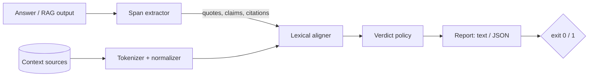

# groundcheck

[English](README.md) | [中文](README.zh.md) | [日本語](README.ja.md)

[](LICENSE) [](CHANGELOG.md) [](pyproject.toml)  [](CONTRIBUTING.md)

**Open-source grounding checker for RAG and LLM output: verifies that every quote and claim actually appears in the provided context, and flags the spans that don't — deterministic lexical alignment, no judge model, cheap enough to run in CI on every change.**


```bash
git clone https://github.com/JaydenCJ/groundcheck && cd groundcheck && pip install -e .
```

> **Pre-release:** groundcheck is not yet published to PyPI. Until the first release, clone [JaydenCJ/groundcheck](https://github.com/JaydenCJ/groundcheck) and run `pip install -e .` from the repository root.

## Why groundcheck?

The top blocker for shipping RAG systems is the answer that *sounds* grounded but isn't: a quote with one word doctored, a percentage that appears nowhere in the retrieved documents, a correct sentence pinned to the wrong citation. The standard defense is to ask another LLM whether the answer is faithful — which costs tokens on every run, returns a different verdict on Tuesday than it did on Monday, and cannot tell you *which word* is fabricated. groundcheck attacks the same problem from below: it extracts every quote and every declarative claim from the answer, then lexically aligns each span against the context you actually supplied — exact token-subsequence search for quotes, stopword-weighted window scoring for claims, hard anchoring for numbers, and citation-target verification. No model, no API key, no network, zero dependencies: the same input produces a byte-identical report on every machine, which is what lets it live in CI next to your linter instead of in a weekly eval dashboard.

|  | groundcheck | RAGAS faithfulness | DeepEval | NLI hallucination models |
|---|---|---|---|---|
| Needs an LLM or API key at check time | No | Yes (judge LLM) | Yes (judge LLM) | No (GPU + weights) |
| Deterministic — same input, same verdict | Yes, byte-identical | No | No | Only if weights are pinned |
| Pinpoints the span and the missing words | Yes, with offsets | score per answer | score per metric | score per sentence |
| Verifies the citation points at the right source | Yes (`miscited`) | No | No | No |
| Catches a single doctored word inside a quote | Yes | Unreliable | Unreliable | Unreliable |
| Flags fabricated figures explicitly | Yes, names them | No | No | No |
| Runtime dependencies | 0 | LLM SDK + deps | 29 | torch + model |
| Cost per check | ~ms of CPU | LLM tokens | LLM tokens | GPU inference |

<sub>Dependency counts are declared runtime requirements on PyPI as of 2026-07: deepeval 4.x (29). groundcheck is lexical by design: it verifies *surface support*, not entailment — a heavily reworded-but-true claim can score low, and a negation can score high. Use it as the deterministic first line of defense, and keep semantic evaluation for what actually needs it.</sub>

## Features

- **Quote fidelity that survives cosmetics** — quotes are matched as normalized token sequences, so re-casing, re-punctuating, curly quotes, and `1,000` vs `1000` never cause a false alarm; swapping one word inside the quote does.
- **Fabricated figures named, not averaged away** — numbers are hard anchors: a claim whose words align but whose `97%` appears nowhere near the evidence is capped at `partial` and the report says exactly which figure is unsupported.
- **Citation auditing** — `[1]`, `[^2]`, `[doc-a]`, `【3】` markers are resolved against your sources; a quote that exists only in a *different* document than the one it cites, or a citation that resolves to nothing, gets the dedicated `miscited` verdict.
- **CI-native by construction** — `--fail-on unsupported|miscited|partial` maps severity to exit code 1, JSON reports have sorted keys for stable git diffs, and the whole check takes milliseconds, offline.
- **Zero dependencies, fully deterministic** — pure Python standard library; no model download, no telemetry, no network calls anywhere; identical inputs produce byte-identical reports on every run and platform.
- **Explainable down to the word** — every finding carries a verdict, a score, the evidence excerpt with source offsets, the list of missing content words, and a one-line reason a reviewer can act on.

## Quickstart

Install:

```bash
git clone https://github.com/JaydenCJ/groundcheck && cd groundcheck && pip install -e .
```

Create a context document and an answer that gets one thing right and two things wrong:

```bash
cat > notes.md <<'EOF'
The migration finished on 2026-03-02. Read latency dropped 38% after the
index rebuild, and the on-call rotation now pages after 5 minutes.
EOF

cat > answer.md <<'EOF'
The runbook says the migration "finished on 2026-03-02" [1].

Read latency dropped 61% after the index rebuild [1].

The rebuild also cut storage costs by a third across all regions [1].
EOF

groundcheck check answer.md notes.md
```

Output (copied from a real run):

```text
answer.md — 3 spans checked against 1 source (notes)

  SUPPORTED    quote  L1   "finished on 2026-03-02"
  PARTIAL      claim  L3   Read latency dropped 61% after the index rebuild.
                        words align with notes (score 0.76) but the figure(s) 61% appear nowhere near the evidence
                        evidence [notes]: Read latency dropped 38% after the index rebuild, and the on-call rotation
  UNSUPPORTED  claim  L5   The rebuild also cut storage costs by a third across all regions.
                        best window in notes scores only 0.14; missing: cut, storage, costs, third, … (+2)

1 supported, 1 partial, 0 miscited, 1 unsupported — support 33%
exit 1 (fail-on unsupported)
```

The same check as a library call, for a pytest gate:

```python
import groundcheck

report = groundcheck.check(answer_text, {"notes": notes_text})
assert not report.fails("unsupported"), report.to_json()
```

A RAG pipeline can also dump one JSON file per request and check it in one shot: `groundcheck check --bundle request.json` (see [`examples/`](examples/) for the full corpus, including a miscitation).

## Verdicts

| Verdict | Meaning | Severity |
|---|---|---|
| `supported` | Quote found verbatim (token-wise), or claim aligned above the supported threshold with all figures present | 0 |
| `partial` | Near-match quote, weakly aligned claim, or aligned words with an absent figure | 1 |
| `miscited` | Supported — but by a different source than the one cited, or the citation resolves to no source | 2 |
| `unsupported` | No source window comes close | 3 |

`--fail-on VERDICT` exits 1 when any finding is at or above that severity; exit 2 is reserved for usage errors. Full JSON schema and matching rules: [`docs/output-format.md`](docs/output-format.md).

## CLI reference

| Flag | Default | Effect |
|---|---|---|
| `--context DIR` | — | Add every `.md`/`.markdown`/`.txt`/`.rst` under DIR (recursive) as sources |
| `--bundle FILE.json` | — | Read `{"answer": …, "sources": …}` from one file instead |
| `--fail-on LEVEL` | `unsupported` | Gate: `partial`, `miscited`, `unsupported`, or `never` |
| `--format text\|json` | `text` | Human report or machine-readable JSON (sorted keys) |
| `--supported-threshold X` | `0.70` | Claim score at or above X is `supported` |
| `--partial-threshold X` | `0.40` | Claim score at or above X is `partial` |
| `--min-quote-words N` | `3` | Shorter quotes stay part of their sentence claim |
| `--quotes-only` | off | Check quoted spans only, skip claim sentences |

`groundcheck spans answer.md` previews the extracted quotes, claims, and citations without judging anything — the debugging view.

## Verification

This repository ships no CI; every claim above is verified by local runs. Reproduce them from a checkout of this repository:

```bash
pip install -e '.[dev]' && pytest && bash scripts/smoke.sh
```

Output (copied from a real run, truncated with `...`):

```text
90 passed in 0.83s
...
[smoke] JSON report deterministic across runs
SMOKE OK
```

## Architecture



## Roadmap

- [x] Span extraction, lexical alignment, number anchoring, citation auditing, four-verdict policy, CLI + library API, JSON bundles (v0.1.0)
- [ ] PyPI release with `pip install groundcheck`
- [ ] Sentence-transformer-free synonym tables as an opt-in leniency layer
- [ ] Structured-output mode: check JSON field values against context, not just prose
- [ ] Baseline files: fail CI only on *new* unsupported spans, like a lint ratchet
- [ ] Pre-built adapters for common RAG frameworks' answer/context objects

See the [open issues](https://github.com/JaydenCJ/groundcheck/issues) for the full list.

## Contributing

Contributions are welcome — start with a [good first issue](https://github.com/JaydenCJ/groundcheck/issues?q=is%3Aissue+is%3Aopen+label%3A%22good+first+issue%22) or open a [discussion](https://github.com/JaydenCJ/groundcheck/discussions). See [CONTRIBUTING.md](CONTRIBUTING.md) for the development setup.

## License

[MIT](LICENSE)
