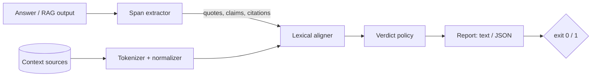

# groundcheck

[English](README.md) | [中文](README.zh.md) | [日本語](README.ja.md)

[](LICENSE) [](CHANGELOG.md) [](pyproject.toml)  [](CONTRIBUTING.md)

**面向 RAG 与 LLM 输出的开源接地（grounding）校验器：逐一验证输出中的每条引文和每个论断是否真的出现在你提供的上下文里，并标出没有依据的片段——确定性词法对齐，不用裁判模型，便宜到可以在 CI 里每次变更都跑。**


```bash
git clone https://github.com/JaydenCJ/groundcheck && cd groundcheck && pip install -e .
```

> **预发布：** groundcheck 尚未发布到 PyPI。在首个正式版之前，请克隆 [JaydenCJ/groundcheck](https://github.com/JaydenCJ/groundcheck) 并在仓库根目录执行 `pip install -e .`。

## 为什么选 groundcheck？

RAG 系统上线的最大拦路虎，是那种*听起来*有依据其实没有的回答：引文里被偷换了一个词、检索文档里根本不存在的百分比、内容正确却挂错引用的句子。业界的标准防线是再问一个 LLM「这个回答忠实吗」——每次运行都烧 token，周二和周一给出的判决还不一样，而且说不出到底*哪个词*是编造的。groundcheck 从下层进攻同一个问题：它把回答中的每条引文和每个陈述性论断抽取出来，然后逐个片段与你实际提供的上下文做词法对齐——引文用精确 token 子序列搜索，论断用停用词加权的窗口打分，数字做硬锚定，引用目标做核对。没有模型、没有 API key、没有网络、零依赖：相同输入在任何机器上产出逐字节一致的报告，这正是它能像 linter 一样常驻 CI、而不是躺在每周评估看板里的原因。

|  | groundcheck | RAGAS faithfulness | DeepEval | NLI 幻觉检测模型 |
|---|---|---|---|---|
| 检查时需要 LLM 或 API key | 不需要 | 需要（裁判 LLM） | 需要（裁判 LLM） | 不需要（GPU + 权重） |
| 确定性——相同输入相同判决 | 是，逐字节一致 | 否 | 否 | 仅当权重被固定 |
| 精确指出片段和缺失的词 | 是，带偏移量 | 整个回答一个分数 | 每个指标一个分数 | 每句一个分数 |
| 核对引用是否指向正确来源 | 是（`miscited`） | 否 | 否 | 否 |
| 揪出引文里被偷换的单个词 | 是 | 不可靠 | 不可靠 | 不可靠 |
| 显式标出编造的数字 | 是，点名列出 | 否 | 否 | 否 |
| 运行时依赖 | 0 | LLM SDK + 依赖 | 29 | torch + 模型 |
| 每次检查的成本 | 约几毫秒 CPU | LLM token | LLM token | GPU 推理 |

<sub>依赖数为 2026-07 时各包在 PyPI 上声明的运行时依赖：deepeval 4.x（29）。groundcheck 在设计上就是词法工具：它验证的是*表面支持*而非蕴含关系——大幅改写但正确的论断可能得低分，否定句可能得高分。请把它当作确定性的第一道防线，把语义评估留给真正需要的地方。</sub>

## 功能

- **经得起「化妆」的引文保真校验** — 引文按归一化 token 序列匹配，改大小写、改标点、弯引号、`1,000` 与 `1000` 都不会误报；但引文内部偷换一个词一定会被抓住。
- **编造的数字被点名，而不是被平均掉** — 数字是硬锚点：一条文字对得上、但 `97%` 在证据附近根本不存在的论断最多只能得 `partial`，报告会明说哪个数字没有依据。
- **引用审计** — `[1]`、`[^2]`、`[doc-a]`、`【3】` 标记会与你的来源逐一解析；引文只存在于与其所引*不同*的文档中，或引用解析不到任何来源时，给出专门的 `miscited` 判决。
- **天生为 CI 而造** — `--fail-on unsupported|miscited|partial` 把严重度映射为退出码 1，JSON 报告键有序、git diff 稳定，整个检查毫秒级完成、全程离线。
- **零依赖、完全确定性** — 纯 Python 标准库；不下载模型、无遥测、任何环节都不碰网络；相同输入在任何平台任何一次运行都产出逐字节一致的报告。
- **可解释到词** — 每条发现都带有判决、分数、含来源偏移量的证据摘录、缺失实词列表，以及一行评审者可以直接行动的理由。

## 快速上手

安装：

```bash
git clone https://github.com/JaydenCJ/groundcheck && cd groundcheck && pip install -e .
```

创建一份上下文文档，以及一个「对一处、错两处」的回答：

```bash
cat > notes.md <<'EOF'
The migration finished on 2026-03-02. Read latency dropped 38% after the
index rebuild, and the on-call rotation now pages after 5 minutes.
EOF

cat > answer.md <<'EOF'
The runbook says the migration "finished on 2026-03-02" [1].

Read latency dropped 61% after the index rebuild [1].

The rebuild also cut storage costs by a third across all regions [1].
EOF

groundcheck check answer.md notes.md
```

输出（摘自真实运行）：

```text
answer.md — 3 spans checked against 1 source (notes)

  SUPPORTED    quote  L1   "finished on 2026-03-02"
  PARTIAL      claim  L3   Read latency dropped 61% after the index rebuild.
                        words align with notes (score 0.76) but the figure(s) 61% appear nowhere near the evidence
                        evidence [notes]: Read latency dropped 38% after the index rebuild, and the on-call rotation
  UNSUPPORTED  claim  L5   The rebuild also cut storage costs by a third across all regions.
                        best window in notes scores only 0.14; missing: cut, storage, costs, third, … (+2)

1 supported, 1 partial, 0 miscited, 1 unsupported — support 33%
exit 1 (fail-on unsupported)
```

同一个检查的库调用形式，可直接做成 pytest 门禁：

```python
import groundcheck

report = groundcheck.check(answer_text, {"notes": notes_text})
assert not report.fails("unsupported"), report.to_json()
```

RAG 管线也可以为每个请求导出一个 JSON 文件、一条命令完成检查：`groundcheck check --bundle request.json`（完整示例语料见 [`examples/`](examples/)，其中包含一个错引案例）。

## 判决

| 判决 | 含义 | 严重度 |
|---|---|---|
| `supported` | 引文按 token 逐字命中，或论断对齐分高于支持阈值且所有数字在场 | 0 |
| `partial` | 近似命中的引文、弱对齐的论断，或文字对齐但数字缺席 | 1 |
| `miscited` | 有依据——但出自与所引不同的来源，或引用解析不到任何来源 | 2 |
| `unsupported` | 没有任何来源窗口接近 | 3 |

`--fail-on VERDICT` 在任一发现达到或超过该严重度时以退出码 1 结束；退出码 2 保留给用法错误。完整 JSON schema 与匹配规则见 [`docs/output-format.md`](docs/output-format.md)。

## CLI 参考

| 参数 | 默认值 | 作用 |
|---|---|---|
| `--context DIR` | — | 递归加入 DIR 下所有 `.md`/`.markdown`/`.txt`/`.rst` 作为来源 |
| `--bundle FILE.json` | — | 改为从单个文件读取 `{"answer": …, "sources": …}` |
| `--fail-on LEVEL` | `unsupported` | 门禁：`partial`、`miscited`、`unsupported` 或 `never` |
| `--format text\|json` | `text` | 人类可读报告或机器可读 JSON（键有序） |
| `--supported-threshold X` | `0.70` | 论断分数达到 X 即为 `supported` |
| `--partial-threshold X` | `0.40` | 论断分数达到 X 即为 `partial` |
| `--min-quote-words N` | `3` | 更短的引文归入所在句子的论断一并检查 |
| `--quotes-only` | 关 | 只检查引文片段，跳过论断句 |

`groundcheck spans answer.md` 预览抽取出的引文、论断和引用而不做任何判决——调试视图。

## 验证

本仓库不带任何 CI；上述所有结论都由本地运行验证。在本仓库的检出中即可复现：

```bash
pip install -e '.[dev]' && pytest && bash scripts/smoke.sh
```

输出（摘自真实运行，以 `...` 截断）：

```text
90 passed in 0.83s
...
[smoke] JSON report deterministic across runs
SMOKE OK
```

## 架构



## 路线图

- [x] 片段抽取、词法对齐、数字锚定、引用审计、四级判决策略、CLI + 库 API、JSON bundle（v0.1.0）
- [ ] 发布到 PyPI，支持 `pip install groundcheck`
- [ ] 不依赖句向量模型的同义词表，作为可选的宽松层
- [ ] 结构化输出模式：对照上下文检查 JSON 字段值，而不止于散文
- [ ] 基线文件：CI 只对*新增*的无依据片段报错，像 lint 棘轮一样
- [ ] 为常见 RAG 框架的 answer/context 对象提供预置适配器

完整列表见 [open issues](https://github.com/JaydenCJ/groundcheck/issues)。

## 贡献

欢迎贡献——可以从 [good first issue](https://github.com/JaydenCJ/groundcheck/issues?q=is%3Aissue+is%3Aopen+label%3A%22good+first+issue%22) 开始，或发起一个 [discussion](https://github.com/JaydenCJ/groundcheck/discussions)。开发环境搭建见 [CONTRIBUTING.md](CONTRIBUTING.md)。

## 许可证

[MIT](LICENSE)
